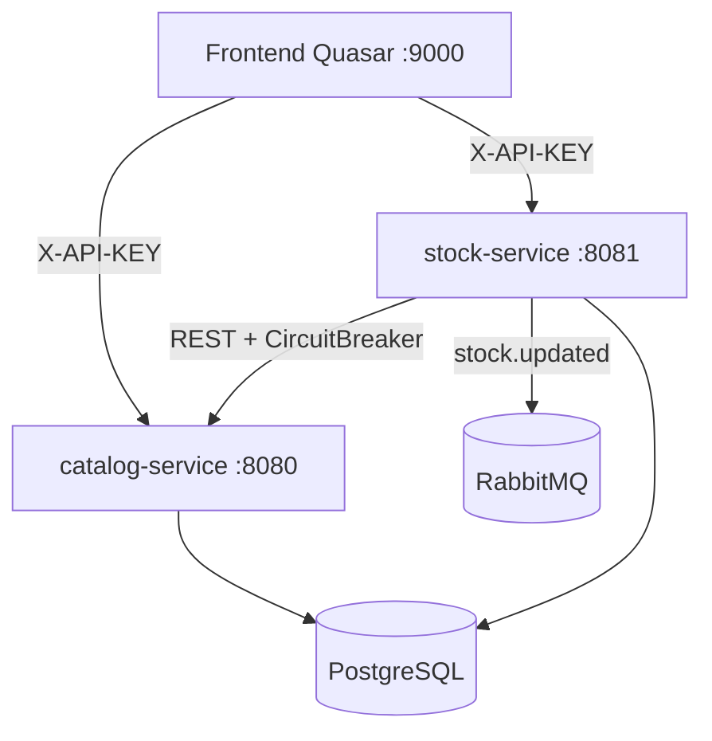

# Plan de Continuación — Linktic Prueba Técnica

**Repo:** `git@github.com:MiguelBeltran93/linktic-prueba.git`  
**Estado:** Fase 1 ✅ completa en `develop` — siguiente: Fase 2 stock-service

---

## Fases del proyecto

| # | Rama | Descripción | Estado |
|---|---|---|---|
| 1 | feature/catalog-service | Microservicio catálogo (puerto 8080) | ✅ |
| 2 | feature/stock-service | Microservicio inventario (puerto 8081) | ⬜ |
| 3 | feature/frontend-design | Paleta de colores Quasar + dark theme | ⬜ |
| 4 | feature/frontend-quasar | App Quasar completa (3 páginas + QStepper) | ⬜ |
| 5 | feature/docker-infraestructura | docker-compose.yml con healthchecks | ⬜ |
| 6 | feature/documentacion | README.md + diagramas Mermaid | ⬜ |
| 7 | — | QA final: tests, cobertura, tag v1.0.0, merge main | ⬜ |

---

## Setup en el nuevo PC

```bash
# 1. Clonar
git clone git@github.com:MiguelBeltran93/linktic-prueba.git
cd linktic-prueba

# 2. Crear rama stock-service desde develop
git checkout develop
git checkout -b feature/stock-service

# 3. Verificar Java 21
java -version   # debe ser 21.x
# Si no: brew install openjdk@21
# export JAVA_HOME="/opt/homebrew/opt/openjdk@21"
# export PATH="$JAVA_HOME/bin:$PATH"
```

---

## FASE 2 — stock-service ⬜

### Estructura de carpetas

```
stock-service/
├── build.gradle
├── settings.gradle
├── Dockerfile
└── src/
    ├── main/java/com/linktic/stock/
    │   ├── StockServiceApplication.java
    │   ├── config/
    │   │   ├── StockAuthFilter.java
    │   │   ├── BrokerConfiguration.java
    │   │   ├── WebSecurityConfiguration.java
    │   │   └── SwaggerConfiguration.java
    │   ├── controller/StockController.java
    │   ├── dto/
    │   │   ├── request/PurchaseRequest.java
    │   │   └── response/{StockRepresentation,PurchaseRepresentation}.java
    │   ├── exception/
    │   │   ├── StockExceptionHandler.java
    │   │   ├── ProductNotFoundException.java
    │   │   └── InsufficientStockException.java
    │   ├── gateway/ProductGateway.java
    │   ├── mapper/StockMapper.java
    │   ├── messaging/
    │   │   ├── StockEventPublisher.java
    │   │   └── StockUpdatedEvent.java
    │   ├── model/{StockEntry,PurchaseRecord}.java
    │   ├── repository/{StockRepository,PurchaseRepository}.java
    │   └── service/StockService.java
    └── main/resources/
        ├── application.yml
        ├── application-docker.yml
        └── logback-spring.xml
    └── test/java/com/linktic/stock/
        ├── controller/StockControllerTest.java
        ├── exception/StockExceptionHandlerTest.java
        ├── integration/StockIntegrationTest.java
        └── service/StockServiceTest.java
```

### settings.gradle

```groovy
rootProject.name = 'stock-service'
```

### build.gradle

```groovy
plugins {
    id 'java'
    id 'org.springframework.boot' version '3.3.4'
    id 'io.spring.dependency-management' version '1.1.6'
    id 'jacoco'
}

group = 'com.linktic'
version = '1.0.0'
java { sourceCompatibility = JavaVersion.VERSION_21 }

configurations {
    compileOnly { extendsFrom annotationProcessor }
}

repositories { mavenCentral() }

dependencies {
    implementation 'org.springframework.boot:spring-boot-starter-web'
    implementation 'org.springframework.boot:spring-boot-starter-data-jpa'
    implementation 'org.springframework.boot:spring-boot-starter-security'
    implementation 'org.springframework.boot:spring-boot-starter-validation'
    implementation 'org.springframework.boot:spring-boot-starter-actuator'
    implementation 'org.springframework.boot:spring-boot-starter-amqp'
    implementation 'org.springframework.boot:spring-boot-starter-aop'
    implementation 'io.github.resilience4j:resilience4j-spring-boot3:2.2.0'
    implementation 'org.springdoc:springdoc-openapi-starter-webmvc-ui:2.5.0'
    implementation 'net.logstash.logback:logstash-logback-encoder:7.4'
    runtimeOnly 'org.postgresql:postgresql'
    compileOnly 'org.projectlombok:lombok'
    annotationProcessor 'org.projectlombok:lombok'

    testImplementation 'org.springframework.boot:spring-boot-starter-test'
    testImplementation 'org.testcontainers:postgresql:1.21.3'
    testImplementation 'org.testcontainers:rabbitmq:1.21.3'
    testImplementation 'org.testcontainers:junit-jupiter:1.21.3'
    testImplementation 'com.github.tomakehurst:wiremock-standalone:3.0.1'
}

jacoco { toolVersion = '0.8.12' }

jacocoTestReport {
    dependsOn test
    reports { xml.required = true; html.required = true }
    afterEvaluate {
        classDirectories.setFrom(files(classDirectories.files.collect {
            fileTree(dir: it, exclude: [
                '**/dto/**', '**/model/**', '**/config/**',
                '**/exception/*Exception*', '**/exception/ErrorResponse*',
                '**/messaging/StockUpdatedEvent*', '**/*Application*'
            ])
        }))
    }
}

jacocoTestCoverageVerification {
    dependsOn jacocoTestReport
    violationRules { rule { limit { minimum = 0.80 } } }
}

test {
    useJUnitPlatform()
    finalizedBy jacocoTestReport
    environment 'TESTCONTAINERS_RYUK_DISABLED', System.getenv('TESTCONTAINERS_RYUK_DISABLED') ?: 'true'
    def customDockerHost = System.getenv('DOCKER_HOST')
    if (customDockerHost) {
        environment 'DOCKER_HOST', customDockerHost
        environment 'TESTCONTAINERS_DOCKER_SOCKET_OVERRIDE', customDockerHost.replaceAll('^unix://', '')
    }
}
```

### Dockerfile

```dockerfile
FROM gradle:8.8-jdk21 AS build
WORKDIR /app
COPY build.gradle settings.gradle ./
COPY src ./src
RUN gradle build -x test --no-daemon

FROM eclipse-temurin:21-jre-jammy
WORKDIR /app
COPY --from=build /app/build/libs/*.jar app.jar
EXPOSE 8081
ENTRYPOINT ["java", "-jar", "app.jar"]
```

### Entidades

```java
// model/StockEntry.java
@Entity @Table(name = "stock_entries")
@EntityListeners(AuditingEntityListener.class)
@Getter @Setter @Builder @NoArgsConstructor @AllArgsConstructor
public class StockEntry {
    @Id @GeneratedValue(strategy = GenerationType.IDENTITY)
    private Long id;
    @Column(nullable = false, unique = true)
    private Long productId;
    @Column(nullable = false)
    private Integer quantity;
    @UpdateTimestamp
    private LocalDateTime updatedAt;
}

// model/PurchaseRecord.java
@Entity @Table(name = "purchase_records")
@EntityListeners(AuditingEntityListener.class)
@Getter @Setter @Builder @NoArgsConstructor @AllArgsConstructor
public class PurchaseRecord {
    @Id @GeneratedValue(strategy = GenerationType.IDENTITY)
    private Long id;
    @Column(nullable = false)
    private Long productId;
    @Column(nullable = false)
    private Integer units;
    @CreatedDate @Column(updatable = false)
    private LocalDateTime purchasedAt;
}
```

### DTOs

```java
// dto/request/PurchaseRequest.java
@Data @Builder @NoArgsConstructor @AllArgsConstructor
public class PurchaseRequest {
    @NotNull @Positive
    private Long productId;
    @NotNull @Min(1)
    private Integer units;
}

// dto/response/StockRepresentation.java
@Data @Builder @NoArgsConstructor @AllArgsConstructor
@JsonInclude(JsonInclude.Include.NON_NULL)
public class StockRepresentation {
    private Long productId;
    private Integer quantity;
    private LocalDateTime updatedAt;
}

// dto/response/PurchaseRepresentation.java
@Data @Builder @NoArgsConstructor @AllArgsConstructor
@JsonInclude(JsonInclude.Include.NON_NULL)
public class PurchaseRepresentation {
    private Long purchaseId;
    private Long productId;
    private Integer units;
    private Integer remainingStock;
    private LocalDateTime purchasedAt;
}
```

### Excepciones

```java
// exception/ProductNotFoundException.java
public class ProductNotFoundException extends RuntimeException {
    public ProductNotFoundException(Long id) {
        super("No product found in catalog with id: " + id);
    }
}

// exception/InsufficientStockException.java
public class InsufficientStockException extends RuntimeException {
    public InsufficientStockException(Long productId, Integer available) {
        super("Insufficient stock for productId: " + productId + ". Available: " + available);
    }
}
```

### StockExceptionHandler.java

```java
@RestControllerAdvice @Slf4j
public class StockExceptionHandler {

    @ExceptionHandler(ProductNotFoundException.class)
    @ResponseStatus(HttpStatus.NOT_FOUND)
    public ErrorResponse handleProductNotFound(ProductNotFoundException ex) {
        log.warn("Product not found: {}", ex.getMessage());
        return buildError("404", "Product Not Found", ex.getMessage());
    }

    @ExceptionHandler(InsufficientStockException.class)
    @ResponseStatus(HttpStatus.UNPROCESSABLE_ENTITY)
    public ErrorResponse handleInsufficientStock(InsufficientStockException ex) {
        log.warn("Insufficient stock: {}", ex.getMessage());
        return buildError("422", "Insufficient Stock", ex.getMessage());
    }

    @ExceptionHandler(MethodArgumentNotValidException.class)
    @ResponseStatus(HttpStatus.UNPROCESSABLE_ENTITY)
    public ErrorResponse handleValidation(MethodArgumentNotValidException ex) {
        List<ErrorResponse.ApiError> errors = ex.getBindingResult().getFieldErrors().stream()
                .map(fe -> ErrorResponse.ApiError.builder()
                        .status("422").title("Validation Error")
                        .detail(fe.getField() + ": " + fe.getDefaultMessage())
                        .build())
                .toList();
        return new ErrorResponse(errors);
    }

    @ExceptionHandler(Exception.class)
    @ResponseStatus(HttpStatus.INTERNAL_SERVER_ERROR)
    public ErrorResponse handleGeneral(Exception ex) {
        log.error("Unexpected error", ex);
        return buildError("500", "Internal Server Error", "An unexpected error occurred");
    }

    private ErrorResponse buildError(String status, String title, String detail) {
        return new ErrorResponse(List.of(
                ErrorResponse.ApiError.builder().status(status).title(title).detail(detail).build()
        ));
    }
}
```

> **Nota:** Reutiliza el mismo `ErrorResponse.java` del catalog-service (misma estructura `{errors:[{status,title,detail}]}`), o crea uno idéntico en `com.linktic.stock.exception`.

### BrokerConfiguration.java

```java
@Configuration
public class BrokerConfiguration {
    public static final String STOCK_EXCHANGE    = "stock.events";
    public static final String STOCK_QUEUE       = "stock.updates.queue";
    public static final String STOCK_ROUTING_KEY = "stock.updated";

    @Bean TopicExchange stockExchange() {
        return new TopicExchange(STOCK_EXCHANGE, true, false);
    }
    @Bean Queue stockQueue() {
        return QueueBuilder.durable(STOCK_QUEUE).build();
    }
    @Bean Binding stockBinding(Queue q, TopicExchange ex) {
        return BindingBuilder.bind(q).to(ex).with(STOCK_ROUTING_KEY);
    }
}
```

### StockUpdatedEvent.java

```java
@Data @Builder @NoArgsConstructor @AllArgsConstructor
public class StockUpdatedEvent {
    private Long productId;
    private Integer newQuantity;
    private String operation;          // "PURCHASE" | "ADJUSTMENT"
    private LocalDateTime occurredAt;
}
```

### StockEventPublisher.java

```java
@Component @RequiredArgsConstructor @Slf4j
public class StockEventPublisher {
    private final RabbitTemplate rabbitTemplate;

    public void publishStockUpdated(Long productId, Integer qty, String operation) {
        StockUpdatedEvent event = StockUpdatedEvent.builder()
                .productId(productId).newQuantity(qty)
                .operation(operation).occurredAt(LocalDateTime.now())
                .build();
        rabbitTemplate.convertAndSend(
                BrokerConfiguration.STOCK_EXCHANGE,
                BrokerConfiguration.STOCK_ROUTING_KEY,
                event);
        log.info("stock.updated published: productId={} qty={} op={}", productId, qty, operation);
    }
}
```

### ProductGateway.java — Resilience4j

```java
@Component @RequiredArgsConstructor @Slf4j
public class ProductGateway {
    private final RestTemplate restTemplate;

    @Value("${services.catalog.url}")   private String catalogUrl;
    @Value("${services.catalog.api-key}") private String catalogApiKey;

    @CircuitBreaker(name = "catalogGateway", fallbackMethod = "fallbackValidate")
    @Retry(name = "catalogGateway")
    public void validateProduct(Long productId) {
        HttpHeaders h = new HttpHeaders();
        h.set("X-API-KEY", catalogApiKey);
        try {
            restTemplate.exchange(catalogUrl + "/api/v1/catalog/items/" + productId,
                    HttpMethod.GET, new HttpEntity<>(h), Object.class);
        } catch (HttpClientErrorException.NotFound e) {
            throw new ProductNotFoundException(productId);
        }
    }

    // Fallback: modo degradado, asume que el producto existe
    public void fallbackValidate(Long productId, Exception ex) {
        log.warn("Circuit breaker open for productId={}: {}", productId, ex.getMessage());
    }

    @Bean
    public RestTemplate restTemplate() { return new RestTemplate(); }
}
```

### StockService.java

```java
@Service @RequiredArgsConstructor @Slf4j
public class StockService {
    private final StockRepository stockRepository;
    private final PurchaseRepository purchaseRepository;
    private final ProductGateway productGateway;
    private final StockEventPublisher eventPublisher;

    public ApiResponse<ApiData<StockRepresentation>> getStock(Long productId) {
        productGateway.validateProduct(productId);
        StockEntry entry = stockRepository.findByProductId(productId)
                .orElseGet(() -> stockRepository.save(
                        StockEntry.builder().productId(productId).quantity(0).build()));
        log.debug("getStock productId={} qty={}", productId, entry.getQuantity());
        return StockMapper.toStockResponse(entry);
    }

    @Transactional
    public ApiResponse<ApiData<PurchaseRepresentation>> processPurchase(PurchaseRequest request) {
        StockEntry entry = stockRepository.findByProductId(request.getProductId())
                .orElseGet(() -> stockRepository.save(
                        StockEntry.builder().productId(request.getProductId()).quantity(0).build()));

        if (entry.getQuantity() < request.getUnits()) {
            throw new InsufficientStockException(request.getProductId(), entry.getQuantity());
        }
        entry.setQuantity(entry.getQuantity() - request.getUnits());
        stockRepository.save(entry);

        PurchaseRecord record = purchaseRepository.save(PurchaseRecord.builder()
                .productId(request.getProductId()).units(request.getUnits()).build());

        eventPublisher.publishStockUpdated(entry.getProductId(), entry.getQuantity(), "PURCHASE");
        log.info("Purchase processed: productId={} units={} remaining={}",
                request.getProductId(), request.getUnits(), entry.getQuantity());
        return StockMapper.toPurchaseResponse(record, entry.getQuantity());
    }

    @Transactional
    public ApiResponse<ApiData<StockRepresentation>> adjustStock(Long productId, Integer quantity) {
        StockEntry entry = stockRepository.findByProductId(productId)
                .orElseGet(() -> stockRepository.save(
                        StockEntry.builder().productId(productId).quantity(0).build()));
        entry.setQuantity(quantity);
        stockRepository.save(entry);
        eventPublisher.publishStockUpdated(productId, quantity, "ADJUSTMENT");
        log.info("Stock adjusted: productId={} newQty={}", productId, quantity);
        return StockMapper.toStockResponse(entry);
    }
}
```

### StockMapper.java

```java
public class StockMapper {
    private StockMapper() {}
    private static final String STOCK_TYPE    = "stock-entries";
    private static final String PURCHASE_TYPE = "purchase-records";

    public static ApiResponse<ApiData<StockRepresentation>> toStockResponse(StockEntry e) {
        return ApiResponse.<ApiData<StockRepresentation>>builder()
                .data(ApiData.<StockRepresentation>builder()
                        .id(String.valueOf(e.getId())).type(STOCK_TYPE)
                        .attributes(StockRepresentation.builder()
                                .productId(e.getProductId())
                                .quantity(e.getQuantity())
                                .updatedAt(e.getUpdatedAt()).build())
                        .build())
                .build();
    }

    public static ApiResponse<ApiData<PurchaseRepresentation>> toPurchaseResponse(
            PurchaseRecord r, Integer remaining) {
        return ApiResponse.<ApiData<PurchaseRepresentation>>builder()
                .data(ApiData.<PurchaseRepresentation>builder()
                        .id(String.valueOf(r.getId())).type(PURCHASE_TYPE)
                        .attributes(PurchaseRepresentation.builder()
                                .purchaseId(r.getId()).productId(r.getProductId())
                                .units(r.getUnits()).remainingStock(remaining)
                                .purchasedAt(r.getPurchasedAt()).build())
                        .build())
                .build();
    }
}
```

> `ApiResponse` y `ApiData` son las mismas clases del catalog-service. Cópielas a `com.linktic.stock.dto.response`.

### StockController.java

```java
@RestController
@RequestMapping("/api/v1/stock")
@RequiredArgsConstructor
@Tag(name = "Stock", description = "Inventory management endpoints")
@SecurityRequirement(name = "X-API-KEY")
public class StockController {
    private final StockService stockService;

    @GetMapping("/{productId}")
    public ResponseEntity<?> getStock(@PathVariable Long productId) {
        return ResponseEntity.ok(stockService.getStock(productId));
    }

    @PostMapping("/purchase")
    @ResponseStatus(HttpStatus.CREATED)
    public ApiResponse<?> purchase(@Valid @RequestBody PurchaseRequest request) {
        return stockService.processPurchase(request);
    }

    @PutMapping("/{productId}/adjust")
    public ApiResponse<?> adjust(
            @PathVariable Long productId,
            @RequestParam @Min(0) Integer quantity) {
        return stockService.adjustStock(productId, quantity);
    }
}
```

### application.yml

```yaml
server:
  port: 8081

spring:
  application:
    name: stock-service
  datasource:
    url: jdbc:postgresql://localhost:5432/linktic_db
    username: postgres
    password: admin
    driver-class-name: org.postgresql.Driver
  jpa:
    hibernate:
      ddl-auto: update
    show-sql: false
    properties:
      hibernate.dialect: org.hibernate.dialect.PostgreSQLDialect
  rabbitmq:
    host: localhost
    port: 5672
    username: guest
    password: guest

security:
  api-key: secret123

services:
  catalog:
    url: http://localhost:8080
    api-key: secret123

resilience4j:
  circuitbreaker:
    instances:
      catalogGateway:
        slidingWindowSize: 5
        failureRateThreshold: 50
        waitDurationInOpenState: 10s
        permittedNumberOfCallsInHalfOpenState: 3
  retry:
    instances:
      catalogGateway:
        maxAttempts: 3
        waitDuration: 500ms

management:
  endpoints:
    web:
      exposure:
        include: health,info
  endpoint:
    health:
      show-details: always

springdoc:
  swagger-ui:
    path: /swagger-ui.html
  api-docs:
    path: /v3/api-docs
```

### application-docker.yml

```yaml
spring:
  datasource:
    url: jdbc:postgresql://postgres:5432/linktic_db
  rabbitmq:
    host: rabbitmq

services:
  catalog:
    url: http://catalog-service:8080
```

### logback-spring.xml

```xml
<?xml version="1.0" encoding="UTF-8"?>
<configuration>
    <springProperty scope="context" name="appName" source="spring.application.name" defaultValue="stock-service"/>
    <appender name="JSON_CONSOLE" class="ch.qos.logback.core.ConsoleAppender">
        <encoder class="net.logstash.logback.encoder.LogstashEncoder">
            <customFields>{"service":"${appName}"}</customFields>
        </encoder>
    </appender>
    <root level="INFO"><appender-ref ref="JSON_CONSOLE"/></root>
    <logger name="com.linktic.stock" level="DEBUG" additivity="false">
        <appender-ref ref="JSON_CONSOLE"/>
    </logger>
    <logger name="org.springframework.web" level="INFO"/>
    <logger name="org.hibernate.SQL" level="WARN"/>
</configuration>
```

### Commits para stock-service

```bash
git add stock-service/src/main/java/com/linktic/stock/model/ \
        stock-service/src/main/java/com/linktic/stock/repository/
git commit -m "feat: add StockEntry, PurchaseRecord entities and repositories"

git add stock-service/src/main/java/com/linktic/stock/dto/ \
        stock-service/src/main/java/com/linktic/stock/exception/ \
        stock-service/src/main/java/com/linktic/stock/mapper/
git commit -m "feat: add stock DTOs, mapper and exception handling"

git add stock-service/src/main/java/com/linktic/stock/messaging/ \
        stock-service/src/main/java/com/linktic/stock/gateway/
git commit -m "feat: add RabbitMQ publisher and ProductGateway with Resilience4j"

git add stock-service/src/main/java/com/linktic/stock/service/ \
        stock-service/src/main/java/com/linktic/stock/controller/ \
        stock-service/src/main/java/com/linktic/stock/StockServiceApplication.java
git commit -m "feat: add StockService and StockController"

git add stock-service/src/main/java/com/linktic/stock/config/
git commit -m "feat: add security, Swagger and broker configuration"

git add stock-service/src/main/resources/
git commit -m "feat: add application config and structured JSON logging"

git add stock-service/build.gradle stock-service/settings.gradle \
        stock-service/gradlew stock-service/gradlew.bat stock-service/gradle/
git commit -m "build: add Gradle Groovy build for stock-service"

git add stock-service/Dockerfile
git commit -m "feat: add multi-stage Dockerfile for stock-service"

git add stock-service/src/test/
git commit -m "test: add unit and integration tests for stock-service"

git push origin feature/stock-service

git checkout develop
git merge --no-ff feature/stock-service -m "feat: merge feature/stock-service into develop"
git push origin develop
```

---

## FASE 3 — frontend-design ⬜

```bash
git checkout develop && git checkout -b feature/frontend-design
```

Solo un commit de paleta de colores:

```bash
cd frontend
npm create quasar@latest .
# Seleccionar: Quasar v2, Vue 3, Composition API, SCSS, ESLint, sin TypeScript
```

Editar `src/css/quasar.variables.scss`:

```scss
$primary   : #3F51B5;   // indigo-600
$secondary : #00BCD4;   // cyan-500
$accent    : #00ACC1;   // cyan-600
$dark      : #1A1A2E;
$dark-page : #0F0F23;
$positive  : #21BA45;
$negative  : #C10015;
$info      : #31CCEC;
$warning   : #F2C037;
```

```bash
git add frontend/
git commit -m "feat: initialize Quasar 2.x with custom dark theme (indigo/cyan)"
git push origin feature/frontend-design
git checkout develop
git merge --no-ff feature/frontend-design -m "feat: merge feature/frontend-design into develop"
git push origin develop
```

---

## FASE 4 — frontend-quasar ⬜

```bash
git checkout develop && git checkout -b feature/frontend-quasar
```

### Estructura

```
frontend/src/
├── api/
│   ├── axios.js          # instancia con baseURL y X-API-KEY interceptor
│   ├── catalogApi.js     # listItems(), getItem(id)
│   └── stockApi.js       # getStock(id), purchase(data), adjustStock(id, qty)
├── pages/
│   ├── CatalogPage.vue   # tabla de productos
│   ├── PurchasePage.vue  # QStepper 3 pasos
│   └── StockPage.vue     # consulta de stock
└── router/routes.js
```

### api/axios.js

```js
import axios from 'axios'

const catalogApi = axios.create({ baseURL: 'http://localhost:8080' })
const stockApi   = axios.create({ baseURL: 'http://localhost:8081' })

const apiKeyInterceptor = config => {
  config.headers['X-API-KEY'] = 'secret123'
  return config
}
catalogApi.interceptors.request.use(apiKeyInterceptor)
stockApi.interceptors.request.use(apiKeyInterceptor)

export { catalogApi, stockApi }
```

### PurchasePage.vue — QStepper 3 pasos

```
Paso 1 — Seleccionar producto
  QSelect con items del catálogo (cargados al montar)

Paso 2 — Cantidad y confirmar
  QInput numérico para unidades
  Resumen: nombre + precio + unidades

Paso 3 — Resultado
  Éxito: "Compra realizada, stock restante: X"
  Error: mensaje de InsufficientStock o ProductNotFound
```

### Commits frontend

```bash
git add frontend/src/api/ frontend/src/router/
git commit -m "feat: add axios instances with X-API-KEY interceptor and routing"

git add frontend/src/pages/CatalogPage.vue
git commit -m "feat: add CatalogPage with product listing table"

git add frontend/src/pages/PurchasePage.vue
git commit -m "feat: add PurchasePage with QStepper 3-step purchase flow"

git add frontend/src/pages/StockPage.vue
git commit -m "feat: add StockPage with stock query by product"

git push origin feature/frontend-quasar
git checkout develop
git merge --no-ff feature/frontend-quasar -m "feat: merge feature/frontend-quasar into develop"
git push origin develop
```

---

## FASE 5 — docker-infraestructura ⬜

```bash
git checkout develop && git checkout -b feature/docker-infraestructura
```

Crear `docker-compose.yml` en la raíz:

```yaml
version: '3.8'

services:
  postgres:
    image: postgres:15
    container_name: linktic-postgres
    environment:
      POSTGRES_DB: linktic_db
      POSTGRES_USER: postgres
      POSTGRES_PASSWORD: admin
    ports: ["5432:5432"]
    volumes: [postgres_data:/var/lib/postgresql/data]
    healthcheck:
      test: ["CMD-SHELL", "pg_isready -U postgres"]
      interval: 5s
      timeout: 5s
      retries: 10

  rabbitmq:
    image: rabbitmq:3.12-management
    container_name: linktic-rabbitmq
    ports: ["5672:5672", "15672:15672"]
    healthcheck:
      test: ["CMD", "rabbitmq-diagnostics", "ping"]
      interval: 10s
      timeout: 5s
      retries: 10

  catalog-service:
    build: ./catalog-service
    container_name: linktic-catalog
    ports: ["8080:8080"]
    environment:
      SPRING_PROFILES_ACTIVE: docker
    depends_on:
      postgres: { condition: service_healthy }
    healthcheck:
      test: ["CMD-SHELL", "curl -f http://localhost:8080/actuator/health || exit 1"]
      interval: 10s
      timeout: 5s
      retries: 10
      start_period: 30s

  stock-service:
    build: ./stock-service
    container_name: linktic-stock
    ports: ["8081:8081"]
    environment:
      SPRING_PROFILES_ACTIVE: docker
    depends_on:
      postgres: { condition: service_healthy }
      rabbitmq: { condition: service_healthy }
      catalog-service: { condition: service_healthy }
    healthcheck:
      test: ["CMD-SHELL", "curl -f http://localhost:8081/actuator/health || exit 1"]
      interval: 10s
      timeout: 5s
      retries: 10
      start_period: 30s

  frontend:
    build: ./frontend
    container_name: linktic-frontend
    ports: ["9000:80"]
    depends_on: [catalog-service, stock-service]

volumes:
  postgres_data:
```

Crear `frontend/Dockerfile`:

```dockerfile
FROM node:20-alpine AS build
WORKDIR /app
COPY package*.json ./
RUN npm install
COPY . .
RUN npm run build

FROM nginx:alpine
COPY --from=build /app/dist/spa /usr/share/nginx/html
EXPOSE 80
```

```bash
git add docker-compose.yml frontend/Dockerfile
git commit -m "feat: add docker-compose with healthchecks for all services"
git push origin feature/docker-infraestructura
git checkout develop
git merge --no-ff feature/docker-infraestructura -m "feat: merge feature/docker-infraestructura into develop"
git push origin develop
```

---

## FASE 6 — documentación ⬜

```bash
git checkout develop && git checkout -b feature/documentacion
```

Crear `README.md` en la raíz con:

```markdown
# Linktic Prueba Técnica

## Arquitectura



## Levantar con Docker

```bash
docker-compose up --build
```

## URLs

| Servicio | URL |
|---|---|
| Frontend | http://localhost:9000 |
| Catalog Swagger | http://localhost:8080/swagger-ui.html |
| Stock Swagger | http://localhost:8081/swagger-ui.html |
| RabbitMQ UI | http://localhost:15672 (guest/guest) |

## Decisiones técnicas

- **Gradle Groovy** en lugar de Maven
- **Lazy creation** en stock: el stock de un producto se crea con qty=0 en el primer acceso
- **RabbitMQ** solo como publisher en stock-service (evento `stock.updated` post-compra)
- **Resilience4j** Circuit Breaker + Retry en la llamada catalog-service→stock-service
- **JSON API spec** en todas las respuestas REST
```

```bash
git add README.md
git commit -m "docs: add README with architecture diagram and setup instructions"
git push origin feature/documentacion
git checkout develop
git merge --no-ff feature/documentacion -m "docs: merge feature/documentacion into develop"
git push origin develop
```

---

## FASE 7 — QA final ⬜

```bash
# Correr todos los tests
cd catalog-service && ./gradlew cleanTest jacocoTestCoverageVerification
cd ../stock-service && ./gradlew cleanTest jacocoTestCoverageVerification

# Levantar todo con Docker y verificar health
docker-compose up --build -d
docker-compose ps   # todos deben estar healthy

# Probar endpoints
curl -s http://localhost:8080/actuator/health | jq
curl -s http://localhost:8081/actuator/health | jq
curl -s -X POST http://localhost:8080/api/v1/catalog/items \
  -H "X-API-KEY: secret123" -H "Content-Type: application/json" \
  -d '{"name":"Laptop","price":999.99}' | jq
curl -s http://localhost:8081/api/v1/stock/1 -H "X-API-KEY: secret123" | jq

# Merge develop → main y tag
git checkout main
git merge --no-ff develop -m "release: v1.0.0"
git tag v1.0.0
git push origin main --tags
```

---

## Workaround Docker en macOS (Docker Desktop 29.x / Colima)

> Testcontainers usa docker-java con API v1.32 pero Docker moderno requiere v1.40+.

```bash
# 1. Instalar y arrancar Colima
brew install colima && colima start

# 2. Crear proxy (una sola vez)
cat > /tmp/docker_proxy.py << 'PYEOF'
import socket, threading, os, re
PROXY = '/tmp/docker-proxy.sock'
REAL  = os.path.expanduser('~/.colima/default/docker.sock')
def upgrade(data):
    try:
        t = data.decode('utf-8', errors='replace')
        def r(m):
            return f'/v1.44/' if (int(m.group(1))==1 and int(m.group(2))<44) else m.group(0)
        return re.sub(r'/v(\d+)\.(\d+)/', r, t).encode()
    except: return data
def fwd(s, d, up=False):
    try:
        while True:
            chunk = s.recv(65536)
            if not chunk: break
            d.sendall(upgrade(chunk) if up else chunk)
    except: pass
    finally:
        for x in [s,d]:
            try: x.close()
            except: pass
def handle(c):
    r = socket.socket(socket.AF_UNIX, socket.SOCK_STREAM)
    r.connect(REAL)
    for a in [(c,r,True),(r,c,False)]:
        threading.Thread(target=fwd,args=a,daemon=True).start()
if os.path.exists(PROXY): os.unlink(PROXY)
s = socket.socket(socket.AF_UNIX, socket.SOCK_STREAM)
s.bind(PROXY); os.chmod(PROXY, 0o777); s.listen(100)
print(f'Proxy OK: {PROXY}')
while True:
    c,_ = s.accept()
    threading.Thread(target=handle,args=(c,),daemon=True).start()
PYEOF

# 3. Arrancar proxy
python3 /tmp/docker_proxy.py &

# 4. ~/.testcontainers.properties
echo "docker.client.strategy=org.testcontainers.dockerclient.EnvironmentAndSystemPropertyClientProviderStrategy" > ~/.testcontainers.properties

# 5. Correr tests con el proxy
export DOCKER_HOST="unix:///tmp/docker-proxy.sock"
./gradlew cleanTest test
```

---

## Checklist completo

| | Fase | Tarea |
|---|---|---|
| ✅ | 1 | catalog-service completo + mergeado en develop |
| ⬜ | 2 | `git checkout -b feature/stock-service` |
| ⬜ | 2 | Entidades StockEntry + PurchaseRecord |
| ⬜ | 2 | StockService (lazy creation, purchase, adjust) |
| ⬜ | 2 | ProductGateway con @CircuitBreaker + @Retry |
| ⬜ | 2 | StockEventPublisher → stock.events exchange |
| ⬜ | 2 | StockController + config + exceptions |
| ⬜ | 2 | Tests ≥80% cobertura + merge a develop |
| ⬜ | 3 | Quasar init + tema oscuro custom |
| ⬜ | 4 | CatalogPage + PurchasePage (QStepper) + StockPage |
| ⬜ | 5 | docker-compose.yml con healthchecks en todos |
| ⬜ | 6 | README.md con diagrama Mermaid |
| ⬜ | 7 | Tests finales + docker-compose up + tag v1.0.0 + merge main |
