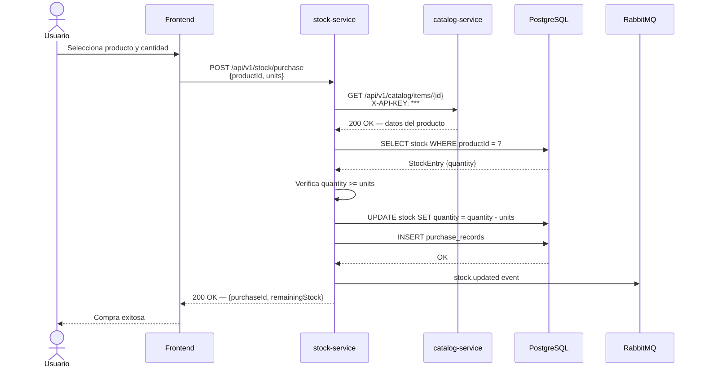
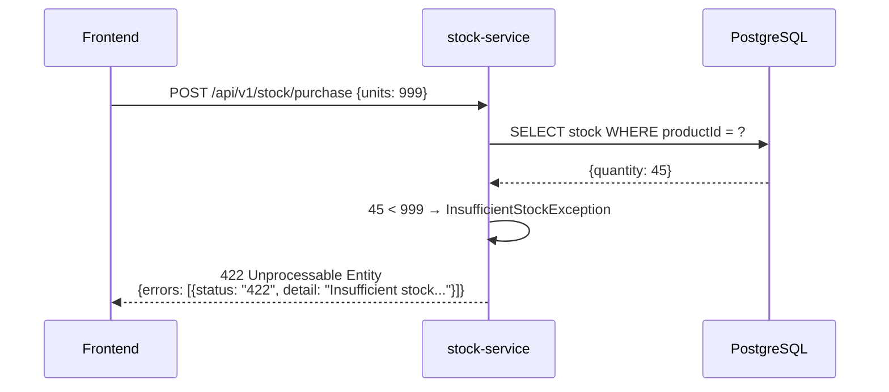
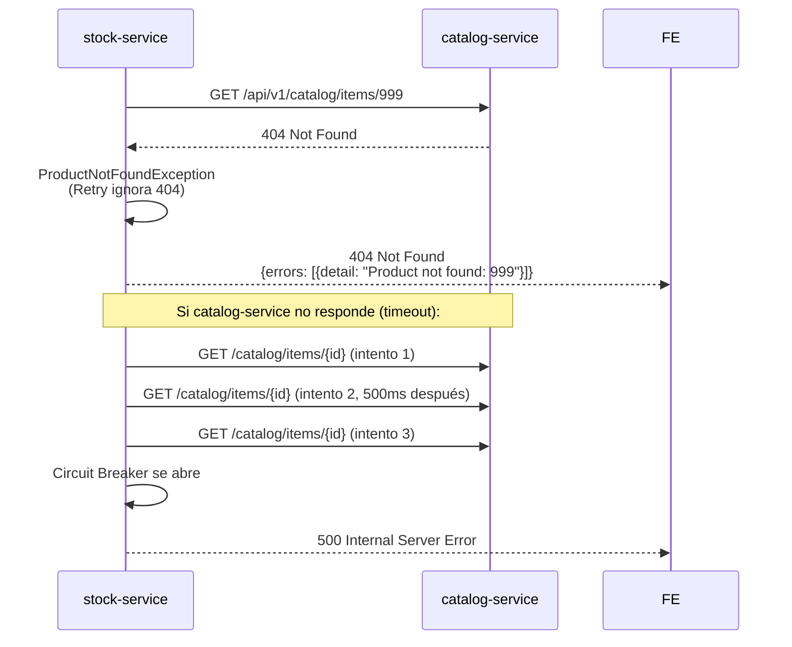

# Linktic — Prueba Técnica

Sistema de microservicios para gestión de productos e inventario, implementado con Spring Boot 3, Quasar 2 y Docker Compose.

---

## Tabla de contenido

1. [Arquitectura](#arquitectura)
2. [Decisiones técnicas](#decisiones-técnicas)
3. [Diagrama de interacción](#diagrama-de-interacción)
4. [Flujo de compra](#flujo-de-compra)
5. [Instalación y ejecución](#instalación-y-ejecución)
6. [Endpoints](#endpoints)
7. [Pruebas](#pruebas)
8. [Uso de herramientas de IA](#uso-de-herramientas-de-ia)

---

## Arquitectura

```
┌─────────────────────────────────────────────────────────┐
│                     Docker Network                       │
│                                                         │
│  ┌──────────────┐     HTTP+API-KEY    ┌───────────────┐ │
│  │   Frontend   │ ──────────────────▶ │    Catalog    │ │
│  │  Quasar/Vue3 │                    │   Service     │ │
│  │  :9000→:80   │ ──────────────────▶ │   :8080       │ │
│  └──────────────┘     HTTP+API-KEY    └──────┬────────┘ │
│                                              │ JPA      │
│  ┌──────────────┐     HTTP+API-KEY    ┌──────▼────────┐ │
│  │   Frontend   │ ──────────────────▶ │     Stock     │ │
│  │  (rutas /    │                    │   Service     │ │
│  │  stock,      │                    │   :8081       │ │
│  │  purchase)   │                    └──┬─────────┬──┘ │
│  └──────────────┘                       │ JPA     │    │
│                                   ┌─────▼──┐  ┌───▼──┐ │
│                                   │Postgres│  │ MQ   │ │
│                                   │  :5432 │  │:5672 │ │
│                                   └────────┘  └──────┘ │
└─────────────────────────────────────────────────────────┘
```

### Componentes

| Servicio | Puerto | Descripción |
|---|---|---|
| `catalog-service` | 8080 | Gestión de productos |
| `stock-service` | 8081 | Inventario y compras |
| `frontend` | 9000 | UI Quasar (nginx) |
| `postgres` | 5432 | Base de datos compartida (schemas separados) |
| `rabbitmq` | 5672 / 15672 | Broker de eventos de inventario |

---

## Decisiones técnicas

### Base de datos: PostgreSQL

Se eligió PostgreSQL sobre SQLite y NoSQL por las siguientes razones:

- **Consistencia transaccional**: el flujo de compra requiere actualizar el stock y registrar la compra de forma atómica (`@Transactional`). PostgreSQL garantiza ACID.
- **Relaciones entre entidades**: `StockEntry` y `PurchaseRecord` tienen relaciones que se modelan naturalmente en SQL.
- **Producción-ready**: a diferencia de SQLite, PostgreSQL soporta conexiones concurrentes reales, lo que es crítico para un servicio de inventario bajo carga.
- **Integración con Spring Data JPA**: soporte nativo sin configuración adicional.

Cada microservicio usa su propio schema lógico dentro de la misma instancia, manteniendo el principio de separación de datos.

### Dónde vive el endpoint de compra

El endpoint `POST /api/v1/stock/purchase` fue implementado en el **stock-service** por las siguientes razones:

- **Responsabilidad única**: el stock-service es el dueño del inventario. Reducir stock es una operación de su dominio.
- **Menor acoplamiento**: catalog-service no necesita conocer reglas de negocio de compra ni acceder a la tabla de inventario.
- **Patrón Saga simplificado**: la compra valida el producto vía HTTP al catalog-service (read-only), luego ejecuta la transacción local de inventario. Si el catalog-service no responde, el circuit breaker aborta la compra sin dejar datos inconsistentes.
- **Cohesión**: el historial de compras (`PurchaseRecord`) vive en el mismo servicio que el inventario, facilitando reportes y auditoría futura.

### Comunicación entre microservicios

- **HTTP sincrono** con `RestTemplate` para validar que el producto existe antes de procesar una compra.
- **RabbitMQ asíncrono** para emitir eventos `stock.updated` tras cada cambio de inventario, desacoplando futuros consumidores (notificaciones, analytics, etc.).
- **Resilience4j** para circuit breaker y reintentos en la comunicación con catalog-service.

### Autenticación

Cada servicio valida el header `X-API-KEY` mediante un `Filter` de Servlet. Las llamadas inter-servicio también incluyen el API key configurado en `application.yml`.

---

## Diagrama de interacción

### Flujo de compra



### Flujo de error — stock insuficiente



### Flujo de error — producto inexistente + circuit breaker



---

## Flujo de compra implementado

1. El frontend envía `POST /api/v1/stock/purchase` con `productId` y `units`.
2. El stock-service valida la existencia del producto llamando al catalog-service vía HTTP (con circuit breaker y retry).
3. Se consulta el `StockEntry` del producto. Si no existe, se crea con `quantity = 0` (lazy initialization).
4. Si `quantity < units` → responde `422 Insufficient Stock`.
5. Si hay suficiente stock → se ejecuta una transacción atómica que descuenta el stock y crea un `PurchaseRecord`.
6. Se publica el evento `stock.updated` en RabbitMQ con `productId`, `newQuantity` y `operation`.
7. Se retorna el detalle de la compra: `purchaseId`, `productId`, `units`, `remainingStock`, `purchasedAt`.

---

## Instalación y ejecución

### Prerrequisitos

- Docker Desktop instalado y corriendo
- Puerto libres: 5432, 5672, 8080, 8081, 9000, 15672

### Levantar todo el stack

```bash
git clone git@github.com:MiguelBeltran93/linktic-prueba.git
cd linktic-prueba
docker compose up --build -d
```

El stack tarda ~60 segundos en estar completamente healthy. Puedes monitorear con:

```bash
docker compose ps
```

### Acceder a los servicios

| Servicio | URL |
|---|---|
| Frontend | http://localhost:9000 |
| Catalog Swagger | http://localhost:8080/swagger-ui/index.html |
| Stock Swagger | http://localhost:8081/swagger-ui/index.html |
| RabbitMQ Management | http://localhost:15672 (guest/guest) |

### Detener el stack

```bash
docker compose down
```

Para borrar también los datos:

```bash
docker compose down -v
```

---

## Endpoints

> Todos los endpoints (excepto `/actuator/health`) requieren el header `X-API-KEY: secret123`.
> Todas las respuestas siguen el estándar [JSON API](https://jsonapi.org/).

### catalog-service — puerto 8080

| Método | Ruta | Descripción |
|---|---|---|
| `POST` | `/api/v1/catalog/items` | Crear producto |
| `GET` | `/api/v1/catalog/items` | Listar todos los productos |
| `GET` | `/api/v1/catalog/items/{id}` | Obtener producto por ID |
| `GET` | `/actuator/health` | Health check |

**Crear producto**

```bash
curl -X POST http://localhost:8080/api/v1/catalog/items \
  -H "X-API-KEY: secret123" \
  -H "Content-Type: application/json" \
  -d '{"name": "Laptop Dell XPS", "price": 1299.99, "description": "16GB RAM"}'
```

```json
{
  "data": {
    "id": "1",
    "type": "catalog-items",
    "attributes": {
      "id": 1,
      "name": "Laptop Dell XPS",
      "price": 1299.99,
      "description": "16GB RAM",
      "createdAt": "2026-05-14T05:12:46.302787"
    }
  }
}
```

### stock-service — puerto 8081

| Método | Ruta | Descripción |
|---|---|---|
| `GET` | `/api/v1/stock/{productId}` | Consultar stock de un producto |
| `PUT` | `/api/v1/stock/{productId}/adjust?quantity={n}` | Actualizar cantidad disponible |
| `POST` | `/api/v1/stock/purchase` | Realizar compra |
| `GET` | `/actuator/health` | Health check |

**Realizar compra**

```bash
curl -X POST http://localhost:8081/api/v1/stock/purchase \
  -H "X-API-KEY: secret123" \
  -H "Content-Type: application/json" \
  -d '{"productId": 1, "units": 5}'
```

```json
{
  "data": {
    "id": "1",
    "type": "purchase-records",
    "attributes": {
      "purchaseId": 1,
      "productId": 1,
      "units": 5,
      "remainingStock": 45,
      "purchasedAt": "2026-05-14T05:18:43.249771"
    }
  }
}
```

**Errores manejados**

| Código | Escenario |
|---|---|
| `401` | Header `X-API-KEY` ausente o inválido |
| `404` | Producto no existe en catalog-service |
| `422` | Stock insuficiente para la cantidad solicitada |
| `500` | catalog-service no disponible (circuit breaker abierto) |

---

## Pruebas

### Correr pruebas unitarias e integración

```bash
# catalog-service
cd catalog-service
./gradlew test jacocoTestReport

# stock-service
cd ../stock-service
./gradlew test jacocoTestReport
```

Los reportes de cobertura se generan en `build/reports/jacoco/test/html/index.html`.

### Cobertura mínima configurada: 80% (nivel Senior)

| Servicio | Clases de prueba |
|---|---|
| catalog-service | `CatalogControllerTest`, `CatalogServiceTest`, `ApiExceptionHandlerTest`, `CatalogIntegrationTest` |
| stock-service | `StockControllerTest`, `StockServiceTest`, `StockExceptionHandlerTest`, `StockIntegrationTest` |

Las pruebas de integración usan **Testcontainers** (PostgreSQL real) y **WireMock** (mock del catalog-service), garantizando que los tests no dependan de infraestructura externa.

---

## Uso de herramientas de IA

Durante el desarrollo se utilizó **Claude (Anthropic)** como asistente para acelerar tareas puntuales del proceso, manteniéndose siempre el criterio técnico propio en las decisiones de arquitectura y diseño.

### Usos principales

- **Consultas técnicas**: dudas sobre configuración de Resilience4j, comportamiento de Testcontainers con WireMock y compatibilidad de versiones entre dependencias.
- **Revisión de código**: validación de implementaciones críticas como el flujo transaccional de compra y el manejo de excepciones en el circuit breaker.
- **Redacción de documentación**: apoyo en la estructuración del README y los diagramas de arquitectura.

### Verificación de calidad

Todo el código fue revisado, ajustado y validado manualmente. Las pruebas unitarias e de integración se ejecutaron contra infraestructura real (Testcontainers + PostgreSQL), y el stack completo fue verificado end-to-end con `docker compose up` antes de cada merge a `develop`.
